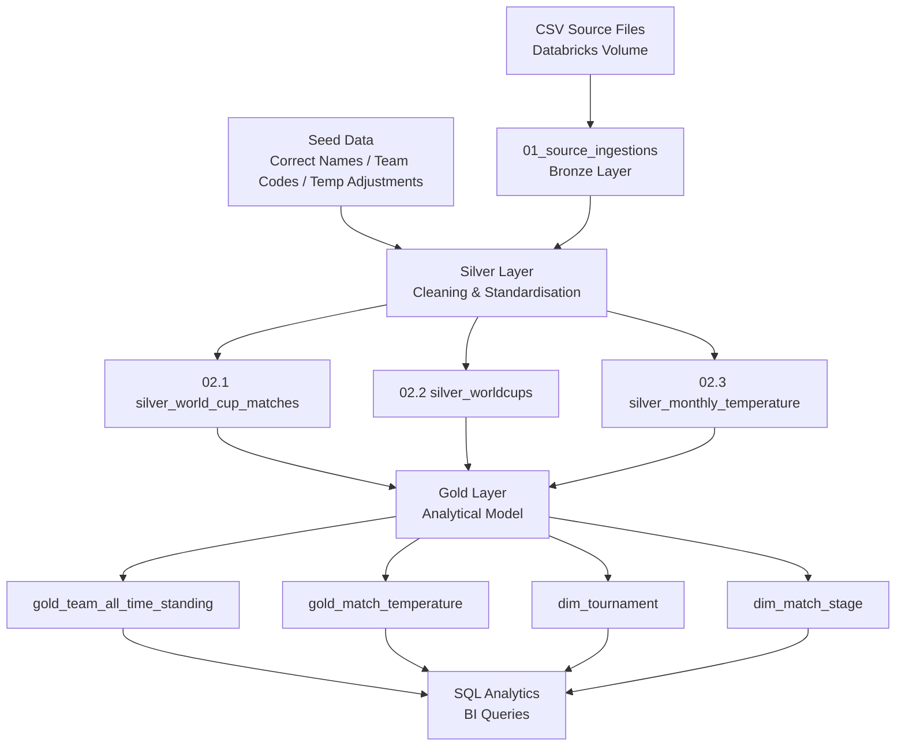
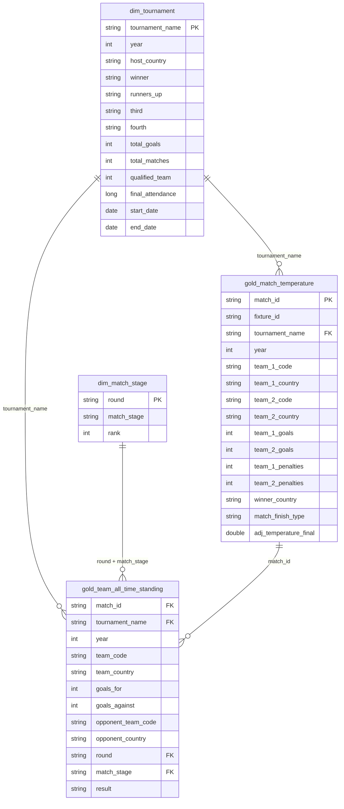

# FIFA World Cup Analytics Pipeline

A data engineering project built on **Databricks** and **Delta Lake** that ingests, cleans, models, and analyses FIFA World Cup match and tournament data, enriched with real-world monthly surface temperature data to support BI-ready analytical queries.

---

## Table of Contents

1. [Project Overview](#1-project-overview)
2. [Objectives](#2-objectives)
3. [Technology Stack](#3-technology-stack)
4. [Solution Architecture](#4-solution-architecture)
5. [Repository Structure](#5-repository-structure)
6. [Data Sources](#6-data-sources)
7. [Data Ingestion](#7-data-ingestion)
8. [Bronze → Silver → Gold Pipeline](#8-bronze--silver--gold-pipeline)
9. [Data Cleaning & Quality Handling](#9-data-cleaning--quality-handling)
10. [Data Modelling / Star Schema](#10-data-modelling--star-schema)
11. [Temperature Enrichment Methodology](#11-temperature-enrichment-methodology)
12. [Gold Layer Tables](#12-gold-layer-tables)
13. [SQL Analytics & Insights](#13-sql-analytics--insights)
14. [Key Engineering Decisions](#14-key-engineering-decisions)
15. [Challenges & Solutions](#15-challenges--solutions)
16. [Reproducibility / How to Run](#16-reproducibility--how-to-run)
17. [Interview Walkthrough](#17-interview-walkthrough)
18. [Future Improvements](#18-future-improvements)
19. [Conclusion](#19-conclusion)

---

## 1. Project Overview

This project builds an end-to-end analytical data pipeline for FIFA World Cup history (1930–present). Raw CSV data is ingested into a **Bronze** layer, cleaned and standardised into a **Silver** layer, and then modelled into a **Gold** layer optimised for BI consumption. The centrepiece enrichment joins each match to the average monthly surface temperature of the host country at the time of the match, with an additional time-of-day adjustment applied to produce a more realistic match-time temperature estimate.

The final Gold layer supports a suite of SQL analytical queries covering all-time team standings, biggest wins, finals appearances, highest-scoring matches, and a temperature-vs-goals quartile analysis.

---

## 2. Objectives

- Ingest and land raw CSV source files into a governed Bronze layer using PySpark on Databricks.
- Clean, standardise, and enrich the data through a Silver transformation layer.
- Design a Star Schema Gold layer optimised for analytical queries and BI dashboards.
- Enrich every match record with the monthly average surface temperature of the host country, adjusted for time of day.
- Deliver SQL queries that extract meaningful insights and demonstrate the value of the enriched data model.

---

## 3. Technology Stack

| Component | Technology |
|---|---|
| Platform | Databricks (Apache Spark runtime) |
| Language | PySpark, SQL |
| Storage Format | Delta Lake |
| Catalogue | Unity Catalog (`fifa_bi_dev`) |
| Notebooks | Databricks Notebooks (`.ipynb`) |
| Source Storage | Databricks Volumes (`/Volumes/fifa_bi_dev/default/source_files`) |

---

## 4. Solution Architecture



The pipeline follows a **Medallion Architecture** (Bronze → Silver → Gold), with seed tables in the Silver schema acting as reference data for name correction and temperature adjustment lookups.

---

## 5. Repository Structure

```
fifa_project/
├── Project Notebooks/
│   ├── 01_source_ingestions.ipynb          # Bronze: ingest all CSVs to Delta
│   ├── 01.1_Seeding.ipynb                  # Silver: seed reference tables
│   ├── 02.1_worldcupmatches_cleaning.ipynb # Silver: match-level cleaning
│   ├── 02.2_worldcup_tournament.ipynb      # Silver: tournament-level cleaning
│   ├── 02.3_average_monthly_surface_temperature.ipynb  # Silver: temperature
│   ├── 03.1_gold_team_all_time_standing.ipynb          # Gold: team standings fact
│   ├── 03.2_dim_match_stage.ipynb          # Gold: match stage dimension
│   ├── 03.3_gold_worldcup_tournament.ipynb # Gold: tournament dimension
│   └── 03.4_gold_match_temprature.ipynb    # Gold: match temperature fact
└── Project Queries/
    ├── All-Time Standings.dbquery.ipynb
    ├── Biggest Wins.dbquery.ipynb
    ├── Finals Appearances.dbquery.ipynb
    ├── Highest Scoring Matches.dbquery.ipynb
    ├── Temp Quartile and Goals Scored.dbquery.ipynb
    └── Tournament Details.dbquery.ipynb
```

Notebooks are numbered to reflect execution order. The `01.x` prefix covers ingestion and seeding, `02.x` covers Silver transformations, and `03.x` covers Gold modelling.

---

## 6. Data Sources

| Dataset | File | Description |
|---|---|---|
| World Cup Matches | `world_cup_matches.csv` | Match-level data: teams, scores, date, time, venue, round |
| World Cup Tournaments | `worldcups.csv` | Tournament-level data: host, winner, attendance, goals, teams |
| Monthly Surface Temperature | `average-monthly-surface-temperature.csv` | Country-level monthly average surface temperature by year |
| Seed: Correct Names | Inline (notebook) | Lookup table mapping corrupted UTF-8 venue/city/team names to correct values |
| Seed: Team Codes | `seed_team_codes.csv` | Maps team names to ISO country codes and standardised country names |
| Seed: Temperature Adjustments | Inline (notebook) | Time-of-day temperature offset table (e.g. afternoon matches are warmer than the monthly average) |

All source files are stored in a Databricks Volume and read directly by PySpark.

---

## 7. Data Ingestion

**Notebook:** `01_source_ingestions.ipynb`

The ingestion notebook reads all three source CSV files from the Databricks Volume in a single loop. Column names are sanitised programmatically using a regex that replaces any non-alphanumeric character with an underscore and lowercases everything — ensuring consistent, safe column names regardless of the source file's formatting.

```python
df = df.toDF(*[
    re.sub(r'[^a-zA-Z0-9_]', '_', c).lower()
    for c in df.columns
])
```

Each file is written to the `fifa_bi_dev.bronze_schema` as a Delta table, with the table name derived automatically from the filename (spaces and hyphens replaced with underscores, `.csv` suffix removed). This makes the ingestion loop generic and reusable for any additional source files.

**Notebook:** `01.1_Seeding.ipynb`

Three seed tables are created in `fifa_bi_dev.silver_schema`:

- `seed_correct_name` — a manually curated lookup of corrupted UTF-8 encoded strings (e.g. `Malm�` → `Malmö`) used to fix stadium names, city names, and team names across the match dataset.
- `seed_team_codes` — loaded from a CSV, maps team names to ISO country codes and standardised country names used consistently across all Gold tables.
- `seed_temp_adjustments` — a time-of-day temperature offset table with six time bands (11AM–11PM), each carrying a `temperature_adjustment_c` value (ranging from +3°C at peak afternoon to -3°C late evening). This is used in the Gold temperature enrichment.

---

## 8. Bronze → Silver → Gold Pipeline

### Bronze Layer

Raw data lands as-is into Delta tables under `fifa_bi_dev.bronze_schema`. No transformations are applied at this layer — it is a faithful copy of the source files, providing a replayable baseline.

| Bronze Table | Source File |
|---|---|
| `world_cup_matches` | `world_cup_matches.csv` |
| `worldcups` | `worldcups.csv` |
| `average_monthly_surface_temperature` | `average-monthly-surface-temperature.csv` |

### Silver Layer

Silver notebooks clean, standardise, and enrich the Bronze data. Each Silver table is written to `fifa_bi_dev.silver_schema`.

| Silver Table | Source | Purpose |
|---|---|---|
| `silver_world_cup_matches` | `bronze.world_cup_matches` + seeds | Cleaned, deduplicated, enriched match records |
| `silver_worldcups` | `bronze.worldcups` + seeds | Cleaned tournament records with standardised attendance |
| `silver_monthly_temperature` | `bronze.average_monthly_surface_temperature` | Renamed and typed temperature records |
| `seed_correct_name` | Inline | UTF-8 name correction lookup |
| `seed_team_codes` | CSV | Team name → country code mapping |
| `seed_temp_adjustments` | Inline | Time-of-day temperature offset lookup |

### Gold Layer

Gold notebooks read from Silver and produce the final analytical model in `fifa_bi_dev.gold_schema`. See [Section 12](#12-gold-layer-tables) for full table details.

---

## 9. Data Cleaning & Quality Handling

**Notebook:** `02.1_worldcupmatches_cleaning.ipynb`

This is the most complex transformation notebook. The following issues were identified and resolved:

**Date parsing:** Match dates in the source are formatted as `dd-MMM-yy` (e.g. `13-Jun-54`). The year field is stored separately. The correct full date is reconstructed by extracting the month and day from the source date string and combining them with the year column:

```python
.withColumn('date', to_date(
    concat_ws("-", col('year'), month(to_date(col('date'), 'dd-MMM-yy')), day(to_date(col('date'), 'dd-MMM-yy'))),
    'yyyy-M-d'
))
```

This avoids the two-digit year ambiguity problem entirely.

**UTF-8 corruption:** Stadium names, city names, and team names contain corrupted characters caused by encoding issues (e.g. `C�te d'Ivoire`). These are resolved via a left join against `seed_correct_name`, applied separately for stadiums, cities, home teams, and away teams.

**Host country derivation:** The 2002 World Cup was co-hosted by Japan and South Korea. The source data records a single `country` value for all matches. Host country is correctly derived by matching the match city against known city lists for each co-host:

```python
.withColumn('host_country',
    when(col('city').isin(japan_cities), 'Japan')
    .when(col('city').isin(korea_cities), 'South Korea')
    .when(trim(col('country')) == 'England', 'United Kingdom')
    .when(trim(col('country')) == 'USA', 'United States')
    .otherwise(trim(col('country')))
)
```

The `England` → `United Kingdom` and `USA` → `United States` mappings ensure the host country name aligns with the temperature dataset's country naming convention, which is critical for the temperature join.

**Duplicate removal:** A window function deduplicates matches that appear more than once at the same datetime, round, and team combination:

```python
w = Window.partitionBy('year','date','time','round','hometeam','awayteam').orderBy('date')
result = result.withColumn('rank', row_number().over(w)).filter(col('rank') == 1).drop('rank')
```

**Match stage classification:** The `round` field uses inconsistent naming across decades. A derived `match_stage` column normalises this into three categories: `Group Stage`, `2nd Group Stage` (used in 1950, 1974, 1978, 1982), and `Knockout Stage`. The 1982 second group stage is identified by both year and date threshold.

**Fixture ID and Match ID generation:** Two surrogate keys are generated using window functions:
- `fixture_id` — identifies a unique fixture (pairing of two teams in a given year and stage), using `dense_rank()` partitioned by year. Format: `F{year}{rank+1000}`.
- `match_id` — identifies a unique match occurrence ordered globally by year, date, and time. Format: `M{year}{row_number+10000}`.

**Replay flag:** Some team pairings appear twice within the same year and stage (replays). A second window function detects these and flags the second occurrence with `replay_flag = 'Replay'`.

**Match finish type and penalties:** The `observation` field is parsed using regex to extract penalty shootout scores and classify matches as `Extra Time`, `Penalties`, or `Golden Goal`.

**Canonical team ordering:** Teams are assigned to `team_1` (alphabetically lesser) and `team_2` (alphabetically greater) using `least()` and `greatest()`. This ensures each fixture has a consistent representation regardless of which team was listed as home or away.

**Notebook:** `02.2_worldcup_tournament.ipynb`

**Attendance normalisation:** The source attendance field uses inconsistent decimal separators (e.g. `868.000` meaning 868,000 vs `1.045.246` meaning 1,045,246). The cleaning logic inspects the number of decimal places after the last separator to determine the correct multiplier:

```python
regexp_replace(col("attendance"), r"\.", "").cast("long")
*
when(~col("attendance").contains("."), 1000)
.when(length(substring_index(col("attendance"), ".", -1)) == 1, 100)
.when(length(substring_index(col("attendance"), ".", -1)) == 2, 10)
.otherwise(1)
```

**Winner/runner-up standardisation:** Team names in the tournament table (winner, runners_up, third, fourth) are standardised via left joins against `seed_team_codes`, replacing historical name variants with consistent country names.

---

## 10. Data Modelling / Star Schema

The Gold layer is structured as a Star Schema centred on match-level facts, with dimensions for tournament, match stage, and team standings.



The model separates match-level temperature data (`gold_match_temperature`) from team performance data (`gold_team_all_time_standing`). This allows each concern to be queried independently or joined via `match_id`.

---

## 11. Temperature Enrichment Methodology

**Notebook:** `03.4_gold_match_temprature.ipynb`

The temperature enrichment is a two-stage join:

**Stage 1 — Monthly average join:**

Each match record carries a `month` field (formatted `yyyy-MM`) and a `host_country` field. The Silver temperature table contains monthly average surface temperatures keyed by `country` and `month`. The join is:

```
match.month == temperature.month
AND match.host_country == temperature.country
```

This produces the baseline monthly average temperature for the host country in the month the match was played.

**Stage 2 — Time-of-day adjustment:**

Monthly averages represent a 24-hour mean. Matches played in the afternoon are typically warmer; evening matches are cooler. The `seed_temp_adjustments` table defines six time bands with an offset in degrees Celsius:

| Time Band | Adjustment |
|---|---|
| 11AM – 1PM | +2°C |
| 1PM – 3PM | +3°C |
| 3PM – 5PM | +2°C |
| 5PM – 7PM | 0°C |
| 7PM – 9PM | -2°C |
| 9PM – 11PM | -3°C |

The join condition uses the hour of the match kick-off time:

```
hour(match.time) >= seed_temp_adjustments.start_hour
AND hour(match.time) < seed_temp_adjustments.end_hour
```

The final adjusted temperature is:

```python
(col('avg_temperature') + col('temperature_adjustment_c')).alias('adj_temperature_final')
```

Matches with no kick-off time recorded receive a `null` adjustment (left join), retaining the raw monthly average. The filter `year >= 1940` excludes pre-war tournaments where data quality is insufficient for meaningful temperature analysis.

---

## 12. Gold Layer Tables

| Table | Grain | Purpose | Key Fields | BI / Analytical Purpose |
|---|---|---|---|---|
| `gold_match_temperature` | One row per match | Central fact table linking match results to adjusted temperature | `match_id`, `fixture_id`, `tournament_name`, `team_1_country`, `team_2_country`, `adj_temperature_final` | Temperature vs. goals analysis, match-level filtering |
| `gold_team_all_time_standing` | One row per team per match | Unpivoted team-match performance fact | `match_id`, `team_code`, `team_country`, `goals_for`, `goals_against`, `result`, `round`, `match_stage` | All-time standings, W/D/L aggregations, goal difference |
| `dim_tournament` | One row per tournament | Tournament dimension with derived start/end dates | `tournament_name`, `year`, `host_country`, `winner`, `final_attendance`, `start_date`, `end_date` | Tournament-level filtering, attendance trends |
| `dim_match_stage` | One row per round/stage combination | Ordered dimension for match stage classification | `round`, `match_stage`, `rank` | Stage-level filtering and ordering in standings queries |

---

## 13. SQL Analytics & Insights

All queries run directly against the Gold layer and are designed to be BI-dashboard-ready.

| Query | Business Question | Main Analysis |
|---|---|---|
| All-Time Standings | Which countries have the strongest all-time World Cup record? | Aggregates W/D/L, goals for/against, goal difference, and tournament appearances per team. Joins `dim_match_stage` to identify 1st/2nd/3rd/4th place finishes using the stage rank. |
| Biggest Wins | What are the most dominant victories in World Cup history? | Filters to winning results, orders by goal margin then goals scored, returns top 20. |
| Finals Appearances | Which countries have appeared in the most World Cup finals? | Filters to `round = 'Final'`, counts appearances, wins, and losses, and aggregates the list of years using `collect_list` and `sort_array`. |
| Highest Scoring Matches | What are the highest-scoring matches ever played? | Filters to wins and draws (to avoid double-counting), orders by total goals, returns top 20 with score and round. |
| Temp Quartile and Goals Scored | Does temperature correlate with the number of goals scored? | Uses `NTILE(4)` window function to divide all matches into four temperature quartiles, then calculates average goals per match per quartile. Enables direct comparison of scoring rates across cold, mild, warm, and hot conditions. |
| Tournament Details | What are the key statistics for each World Cup edition? | Retrieves all tournament-level metrics from `dim_tournament`, including derived average attendance per match (`final_attendance / total_matches`). |

### Temperature Quartile Analysis

The temperature quartile query is the primary analytical output of the enrichment work. By bucketing matches into four equal-sized temperature groups using `NTILE(4)` and computing average goals per match within each bucket, it provides a data-driven basis for exploring whether ambient temperature influences match scoring patterns — a question that cannot be answered without the enrichment pipeline.

---

## 14. Key Engineering Decisions

**Medallion Architecture:** Separating Bronze (raw), Silver (clean), and Gold (modelled) layers ensures that raw data is always preserved and replayable, transformations are isolated and testable, and the Gold layer is purpose-built for analytics without carrying cleaning logic.

**Seed tables in Silver schema:** Reference data (name corrections, team codes, temperature adjustments) is materialised as Delta tables rather than hardcoded in transformation logic. This makes corrections auditable, reusable across notebooks, and easy to update without modifying transformation code.

**Canonical team ordering with `least()`/`greatest()`:** Assigning teams to `team_1`/`team_2` alphabetically ensures that each fixture has a single, consistent representation. Without this, the same match could appear twice in aggregations (once from each team's perspective as home/away).

**Unpivoted team standings:** `gold_team_all_time_standing` is built by unioning two projections of the match table — one from `team_1`'s perspective and one from `team_2`'s. This row-per-team-per-match grain makes aggregations (total wins, goals for, appearances) trivial SQL `GROUP BY` operations without complex self-joins.

**Host country name alignment:** The `host_country` field in the match data is deliberately mapped to match the country naming convention used in the temperature dataset. Without this alignment (e.g. `England` → `United Kingdom`, `USA` → `United States`), the temperature join would silently produce nulls for those tournaments.

**Time-of-day temperature adjustment:** Monthly averages are a 24-hour mean and do not reflect the actual conditions during a match. The adjustment seed table introduces a domain-informed correction based on time of day, making the temperature figure more analytically meaningful for match-level analysis.

**Delta Lake format throughout:** All tables — Bronze, Silver, and Gold — are stored as Delta tables. This provides ACID transactions, schema enforcement, and the ability to overwrite with schema evolution (`overwriteSchema = true`) during iterative development.

---

## 15. Challenges & Solutions

**Challenge: Two-digit year ambiguity in match dates**
The source date field uses a two-digit year (`dd-MMM-yy`), which Spark would misinterpret for pre-2000 tournaments. The solution reconstructs the full date by extracting only the month and day from the source string and combining them with the separate, reliable `year` column.

**Challenge: Co-hosted 2002 World Cup**
The source data records a single country for all 2002 matches, making it impossible to determine whether a match was played in Japan or South Korea from the country field alone. The solution uses city-level lookup lists to correctly assign host country per match, which is essential for the temperature join.

**Challenge: Inconsistent attendance formatting**
The tournament attendance field uses European-style decimal separators inconsistently (e.g. `868.000` = 868,000 but `1.045.246` = 1,045,246). The cleaning logic inspects the length of the substring after the last separator to determine the correct multiplier, correctly normalising all values to actual attendance figures.

**Challenge: UTF-8 encoding corruption**
Special characters in venue and team names were corrupted during CSV export (e.g. `Malm�` instead of `Malmö`). A seed table of known corrupted-to-correct mappings is applied via left join, covering all affected stadiums, cities, and team names.

**Challenge: Replay matches**
Some team pairings appear more than once within the same tournament stage (replays). A window function detects these by ranking occurrences of the same team pairing within the same year and stage, flagging the second occurrence as a replay rather than discarding it.

**Challenge: Historical round name inconsistency**
Round names vary significantly across decades (e.g. `First round`, `Round of 16`, `Preliminary round` all refer to the same stage concept). The `dim_match_stage` dimension assigns a numeric `rank` to each round/stage combination, enabling consistent ordering and filtering across all eras.

---

## 16. Reproducibility / How to Run

### Prerequisites

- Databricks workspace with Unity Catalog enabled
- A Unity Catalog catalogue named `fifa_bi_dev` with schemas: `bronze_schema`, `silver_schema`, `gold_schema`
- A Databricks Volume at `/Volumes/fifa_bi_dev/default/source_files/` containing:
  - `world_cup_matches.csv`
  - `worldcups.csv`
  - `average-monthly-surface-temperature.csv`
  - `seed_team_codes.csv`

### Execution Order

Run notebooks in the following sequence:

```
1. 01_source_ingestions.ipynb       → Populates bronze_schema
2. 01.1_Seeding.ipynb               → Populates silver_schema seed tables
3. 02.1_worldcupmatches_cleaning.ipynb  → Produces silver_world_cup_matches
4. 02.2_worldcup_tournament.ipynb   → Produces silver_worldcups
5. 02.3_average_monthly_surface_temperature.ipynb → Produces silver_monthly_temperature
6. 03.1_gold_team_all_time_standing.ipynb → Produces gold_team_all_time_standing
7. 03.2_dim_match_stage.ipynb       → Produces dim_match_stage
8. 03.3_gold_worldcup_tournament.ipynb  → Produces dim_tournament
9. 03.4_gold_match_temprature.ipynb → Produces gold_match_temperature
```

Once the Gold layer is populated, all queries in `Project Queries/` can be run in any order against `fifa_bi_dev.gold_schema`.

---

## 17. Interview Walkthrough

### Architecture

The pipeline follows a Medallion Architecture. Bronze is a raw landing zone — no transformations, just typed Delta tables. Silver applies all cleaning, standardisation, and enrichment logic. Gold is the analytical model, structured for BI consumption. Seed tables live in Silver and act as reference data for both Silver transformations and Gold enrichment.

### ETL/ELT Logic

The pipeline is ETL: data is transformed in PySpark before being written to the target layer. The ingestion notebook is generic and loop-driven. Silver notebooks are purpose-built per dataset. Gold notebooks read from Silver and apply final modelling logic.

### Data Modelling

The Gold layer is a Star Schema. `gold_match_temperature` and `gold_team_all_time_standing` are fact tables at match grain. `dim_tournament` and `dim_match_stage` are dimensions. The team standings table is deliberately unpivoted (one row per team per match) to make aggregations simple and avoid complex pivot logic in SQL.

### Temperature Enrichment

The enrichment is a two-stage join: first on `month` and `host_country` to get the monthly average, then on the hour of kick-off against the time-of-day adjustment seed to apply a contextual offset. The host country mapping is carefully aligned to the temperature dataset's naming convention to prevent silent join failures.

### Data Quality

Key challenges handled: date reconstruction to avoid two-digit year ambiguity, UTF-8 name correction via seed lookup, co-hosted tournament city-based host country derivation, attendance normalisation from inconsistent decimal formatting, duplicate match removal via window function, and replay match flagging.

---

## 18. Future Improvements

- **Orchestration:** Introduce a workflow tool (e.g. Databricks Workflows) to schedule and sequence notebook execution with dependency management and retry logic.
- **Data quality checks:** Add explicit assertion-based checks (e.g. null counts, row count reconciliation between Bronze and Silver) as a dedicated quality gate notebook.
- **Incremental loading:** The current pipeline uses full overwrite. For larger datasets, incremental merge patterns (Delta `MERGE INTO`) would be more efficient.
- **Player-level data:** Extending the model with goalscorer and player appearance data would enable player-level analytics (top scorers, appearances, etc.).
- **Extended temperature coverage:** The current temperature join is at monthly granularity. Daily temperature data would allow a more precise match-day temperature estimate.
- **BI layer:** Connect the Gold schema to a BI tool (e.g. Databricks SQL, Power BI, Tableau) to build interactive dashboards on top of the analytical queries.

---

## 19. Conclusion

This project demonstrates a complete, production-structured data engineering pipeline built on Databricks and Delta Lake. It covers the full lifecycle from raw CSV ingestion through to a BI-ready Star Schema, with particular attention to data quality challenges that are common in real-world historical datasets — encoding corruption, inconsistent formatting, co-hosted events, and ambiguous date representations.

The temperature enrichment layer adds genuine analytical value by enabling correlation analysis between ambient conditions and match outcomes, demonstrated through the temperature quartile query. The Gold layer is designed to be simple to query, with the heavy lifting done in PySpark transformations rather than pushed into SQL at query time.